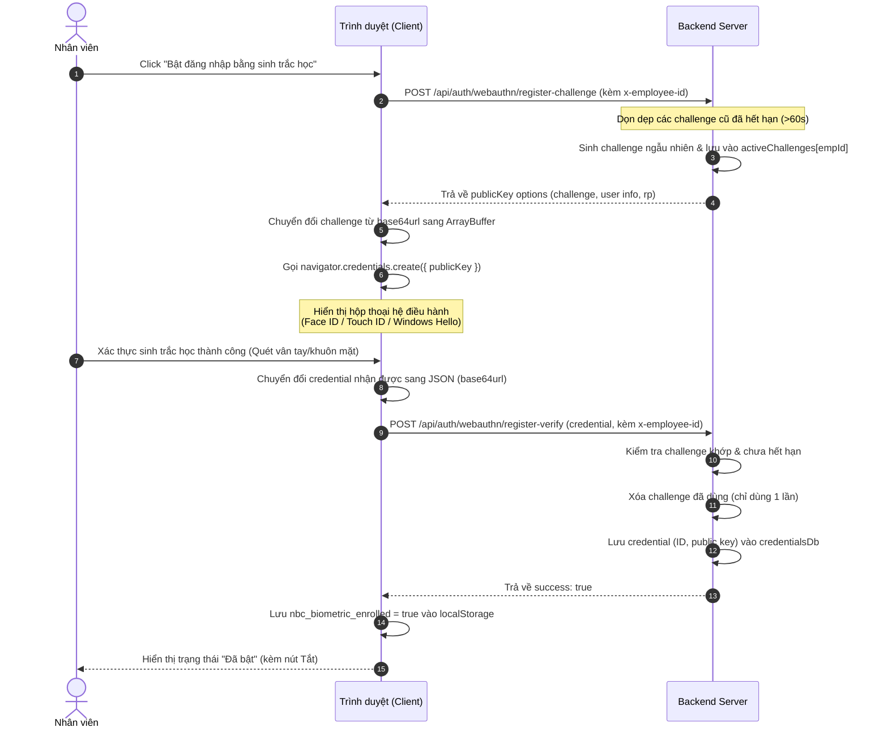
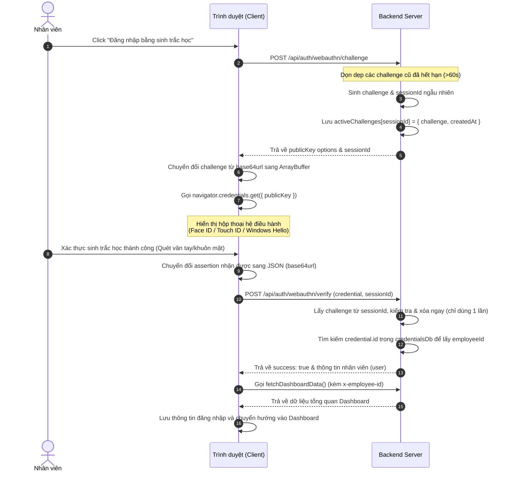

# BÁO CÁO CHI TIẾT HỆ THỐNG XÁC THỰC SINH TRẮC HỌC (WEBAUTHN / PASSKEY)

Tài liệu này mô tả chi tiết kiến trúc, luồng hoạt động, các API và cơ chế bảo mật của tính năng đăng ký và đăng nhập bằng sinh trắc học (vân tay, khuôn mặt) được tích hợp trong hệ thống nhân sự NBC.

---

## 1. TỔNG QUAN CÔNG NGHỆ (WEBAUTHN)

Hệ thống sử dụng tiêu chuẩn **WebAuthn (Web Authentication)** - một phần của chuẩn FIDO2, được hỗ trợ sẵn bởi các trình duyệt hiện đại trên cả thiết bị di động (Face ID/Vân tay trên iOS/Android) và máy tính (Touch ID trên macOS, Windows Hello trên Windows).

### Ưu điểm:
- **Không cần mật khẩu (Passwordless)**: Người dùng không cần nhớ mật khẩu phức tạp.
- **Chống tấn công Phishing**: Khóa công khai (Public Key) được liên kết chặt chẽ với tên miền (`rpId`). Trình duyệt sẽ từ chối xác thực nếu tên miền bị thay đổi.
- **Bảo mật tuyệt đối**: Dữ liệu sinh trắc học (vân tay/khuôn mặt) được lưu trữ an toàn trong chip bảo mật của thiết bị (Secure Enclave/TPM) và không bao giờ được gửi lên Server. Server chỉ lưu trữ khóa công khai để xác minh chữ ký số.

---

## 2. LUỒNG ĐĂNG KÝ SINH TRẮC HỌC (ENROLLMENT FLOW)

Luồng này được thực hiện khi nhân viên đã đăng nhập bằng tài khoản/mật khẩu và muốn kích hoạt tính năng sinh trắc học trong tab **Hồ sơ cá nhân**.

### Sơ đồ tuần tự (Sequence Diagram):

### Chi tiết các bước xử lý:

1. **Yêu cầu Challenge**: Client gửi yêu cầu lên `/api/auth/webauthn/register-challenge` kèm header định danh nhân viên `x-employee-id`.
2. **Sinh Challenge**: Server tạo một chuỗi challenge ngẫu nhiên dạng `base64url`, lưu vào bộ nhớ tạm `activeChallenges[empId]` kèm thời gian tạo `createdAt` để kiểm soát hết hạn (60 giây), sau đó trả về các tùy chọn đăng ký (`publicKey`).
3. **Gọi API Trình duyệt**: Client nhận cấu hình, chuyển đổi challenge từ chuỗi sang `ArrayBuffer` và gọi hàm native của trình duyệt `navigator.credentials.create()`.
4. **Xác thực Thiết bị**: Hệ điều hành hiển thị hộp thoại yêu cầu người dùng quét vân tay hoặc khuôn mặt. Sau khi quét thành công, thiết bị sẽ tạo ra một cặp khóa (Public/Private Key) mới dành riêng cho trang web này.
5. **Gửi Credential**: Client nhận kết quả, chuyển đổi các trường dữ liệu nhị phân sang chuỗi `base64url` và gửi lên `/api/auth/webauthn/register-verify`.
6. **Xác minh & Lưu trữ**: Server kiểm tra challenge gửi lên có khớp với challenge đã sinh cho nhân viên đó và chưa quá 60 giây hay không. Nếu hợp lệ, Server lưu khóa công khai (Public Key) và Credential ID vào `credentialsDb` liên kết với mã nhân viên, đồng thời xóa challenge tạm thời.

---

## 3. LUỒNG ĐĂNG NHẬP SINH TRẮC HỌC (AUTHENTICATION FLOW)

Luồng này được thực hiện tại màn hình đăng nhập (`LoginPage.jsx`) khi thiết bị đã được đăng ký sinh trắc học trước đó (`localStorage` có cờ `nbc_biometric_enrolled === true`).

### Sơ đồ tuần tự (Sequence Diagram):

### Chi tiết các bước xử lý:

1. **Yêu cầu Challenge Đăng nhập**: Client gửi yêu cầu lên `/api/auth/webauthn/challenge`.
2. **Sinh Session-based Challenge**: Server tạo một challenge ngẫu nhiên và một `sessionId` duy nhất (sử dụng `crypto.randomBytes(16)`). Lưu thông tin này vào `activeChallenges[sessionId]` kèm thời gian tạo. Điều này giúp ngăn chặn lỗi ghi đè challenge khi nhiều người dùng đăng nhập cùng lúc.
3. **Gọi API Trình duyệt**: Client nhận challenge và `sessionId`, gọi `navigator.credentials.get()` để yêu cầu thiết bị ký tên lên challenge bằng khóa bí mật (Private Key) đã được tạo lúc đăng ký.
4. **Xác thực Thiết bị**: Người dùng quét vân tay/khuôn mặt để mở khóa Private Key. Thiết bị ký lên challenge và trả về chữ ký số cùng Credential ID.
5. **Gửi Xác thực**: Client gửi Credential ID, chữ ký số và `sessionId` lên `/api/auth/webauthn/verify`.
6. **Xác thực phía Server**:
   - Server tìm kiếm challenge tương ứng với `sessionId` trong `activeChallenges`. Nếu không tìm thấy hoặc đã quá 60 giây, trả về lỗi 400.
   - Xóa ngay challenge khỏi bộ nhớ tạm (chỉ dùng 1 lần) để chống tấn công phát lại (Replay Attack).
   - Tìm kiếm Credential ID trong `credentialsDb`. Nếu tìm thấy, lấy ra mã nhân viên liên kết (`employeeId`), tạo phiên đăng nhập và trả về thông tin nhân viên cho Client.

---

## 4. CƠ CHẾ BẢO MẬT ĐÃ ĐƯỢC TỐI ƯU HÓA

Để đảm bảo hệ thống hoạt động ổn định và an toàn trong môi trường thực tế, các cơ chế sau đã được triển khai:

1. **Session-based Challenge**: Mỗi yêu cầu đăng nhập sinh ra một `sessionId` riêng biệt. Challenge được lưu theo `sessionId` thay vì lưu chung một key cố định, giải quyết triệt để lỗi xung đột/ghi đè challenge khi nhiều người dùng đăng nhập đồng thời.
2. **Challenge dùng một lần (Use-Once)**: Ngay khi nhận được yêu cầu xác thực (verify), Server sẽ xóa challenge tương ứng khỏi bộ nhớ tạm dù xác thực thành công hay thất bại. Điều này ngăn chặn kẻ tấn công chặn bắt gói tin và gửi lại (Replay Attack).
3. **Cơ chế dọn rác tự động (Garbage Collection)**: Mỗi khi có yêu cầu tạo challenge mới, Server sẽ duyệt qua danh sách `activeChallenges` và tự động xóa các challenge đã quá hạn 60 giây để tránh rò rỉ bộ nhớ (Memory Leak).
4. **Không phụ thuộc thư viện ngoài ở Frontend**: Toàn bộ luồng xử lý WebAuthn ở Frontend được viết bằng Javascript thuần (`navigator.credentials`), tối ưu dung lượng bundle và tránh rủi ro bảo mật từ các thư viện bên thứ ba.
